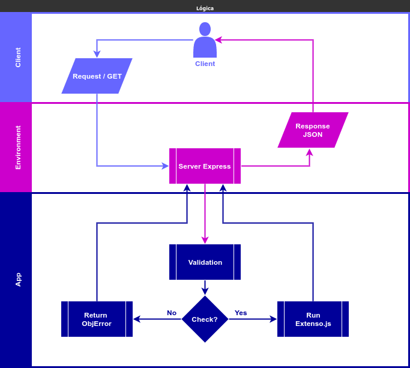

# Group CERTI

Teste técnico - Desenvolvedor de software Junior

## Requisítos

### Requisítos de desenvolvimento

- [x] Lingauem livre;
- [x] Criar servidor HTTP para processar requisições GET;
- [x] Saída das requisições GET deve ser formatada em JSON;
- [x] Saída deve conter uma chave com a nomenclatura **extenso**, seguída pela versão por extenso do número(**inteiro**) recebido no path;
- [x] números devem estar no intervalo [-99999, 99999].

#### Exemplos

    curl http://localhost:3000/1 -> { "extenso": "um" }
    curl http://localhost:3000/-1042 -> { "extenso": "menos mil e quarenta e dois" }
    curl http://localhost:3000/94587 -> { "extenso": "noventa e quatro mil e quinhentos e oitenta e sete" }

### Requisítos de entrega

- [x] Enviar o link do repositório no GitHub com o código em até sete dias úteis;
- [x] Documentação no arquivo README.md;
- [x] Remover "e"s separando milhares, centenas e dezenas (vide exemplo): "noventa e quatro mil e quinhentos e oitenta e sete" (Esse não é o padrão da norma culta da língua portuguesa, e isso é intencional.);
- [ ] O código deve implementar algoritmo de tradução.

**Bônus:** Crie um ambiente Docker para que possamos rodar seu servidor sem instalar dependências locais.

**Nota:**
Em caso de dúvidas sobre o desafio, mande um email para ept@c**\*\***i.org.br e mzr@c**\*\***i.org.br;
Prestamos atenção no review: edge cases e tratamento de erros, testes unitários, estruturação e qualidade do código, uso do git...

## Utilização da aplicação / Implementação

**NOTA:** Para executar qualquer um dos comandos abaixo, é imprescindível ter o gerenciador de dependencia NPM instalado globalmente em seu computador, e nagevar para dentro do diretório root da aplicação para que todos os comandos possam ser executados com sucesso.

### Instalação local

Para fazer a instalação de todas as dependencias necessárias da aplicação, execute a seguinte linha de comando no terminal/console.

    npm i

**Nota**: Se após a intalação você receber informações de vulnerabilidades nas dependencias instaladas, execute o seguinte comando para corrigir eventuais vulnerabilidades

    npm audit fix && npm audit fix --force

### Modo desenvolvimento

Após concluir a instalação de todas as dependencias da aplicação, é possível executar o comando de desenvolvimento no terminal/console.

**Nota**: Este comando usa as variaveis de ambiente contidas no arquivo `.env.development`. Por motivos de segurança, é normal que este arquivo esteja incluído no arquivo `.gitignore`, caso isso acontecer, crie seu próprio arquivo `.env.development` com suas variaveis de ambiente utilizando o arquivo modelo `.env.example`.

    npm run server

Depois de executar o comando acima, abra [http://localhost:8000/123](http://localhost:8000/123) para renderizar a saída JSON da aplicação no seu browser preferido.

### Modo produção

Para startar a aplicação em modo producão, execute o seguinte comando.

**Nota**: Este comando usa as variaveis de ambiente contidas no arquivo `.env.production`. Por motivos de segurança, é normal que este arquivo esteja incluído no arquivo `.gitignore`, caso isso acontecer, crie seu próprio arquivo `.env.production` com suas variaveis de ambiente utilizando o arquivo modelo `.env.example`.

    npm run start

### Modo de testes

Para testar/validar todos as saídas JSON da aplicação em modo automático, execute o seguinte comando no terminal/console.

**Nota**: Este comando executa um teste de saída no formato JSON, do número 0 ao número 99999, você vai receber uma resposta do servidor com todos os nomes de números que a aplicação é capaz de retornar(no teste apenas números positivos). O servidor também salva uma cópia do teste no diretório raíz com o nome `test_log.json`. Esse JSON de sáida terá 100 mil linhas(aproximadamente 11MB).

Teste no seu localhost

    http://localhost:8000/check

Teste no Heroku

    https://ivanespinola.herokuapp.com/check

Ou teste no seu ambiente preferido

    www.seu_host.com.br/check

## Principais tecnologias integradas

- [x] Node
- [x] Express
- [x] JavaScript
- [x] Docker
- [x] DotEnv
- [x] Git

## Estrutura de arquivos

    App/
    ├── Dockerfile
    ├── LICENSE
    ├── package.json
    ├── package-lock.json
    ├── README.md
    ├── settings
    │   ├── .env.development
    │   ├── .env.example
    │   └── .env.production
    ├── server
    │   └── index.js
    └── webservice
        ├── core.js
        ├── my_core.js
        └── test.js

## Metodologia de funcionamento

## Detalhes

Eu criei um algoritmo em .js(`./webservice/disabled_my_core.js`) capaz de resolver esse teste, porem, por questão de tempo, eu não pude finaliza-lo, e executar os devidos teste de validação, digo que este esta 90% concluído. Além disso, eu pretendia implementar nesse mesmo **_core_** uma função capaz de trocar a linguagem dos textos de acordo com um parametro enviado junto com a requisição, ou recebendo esse valor de acordo com a linguagem configurada pelo browser do usuário quando a requisição fosse feita por um browser. Mas ao invez disso, eu utilizei uma dependencia[https://extenso.js.org/](https://extenso.js.org/) capaz de resolver o problema. O arquivo `./webservice/core.js` valida os parametos recebidos e após serem validados, o **_core_** então chama a dependência Extenso e retorna a saída em JSON para o servidor Node, Caso os parametros recebidos na requisição sejam invalidos, uma resposta de erro reporta o erro em formatato JSON.

Eu também fiz um deploy da branch `statement` na plataforma Heroku para seu acesso. Você pode acessar a aplicação em modo produção em
[https://ivanespinola.herokuapp.com/12345](https://ivanespinola.herokuapp.com/12345).
